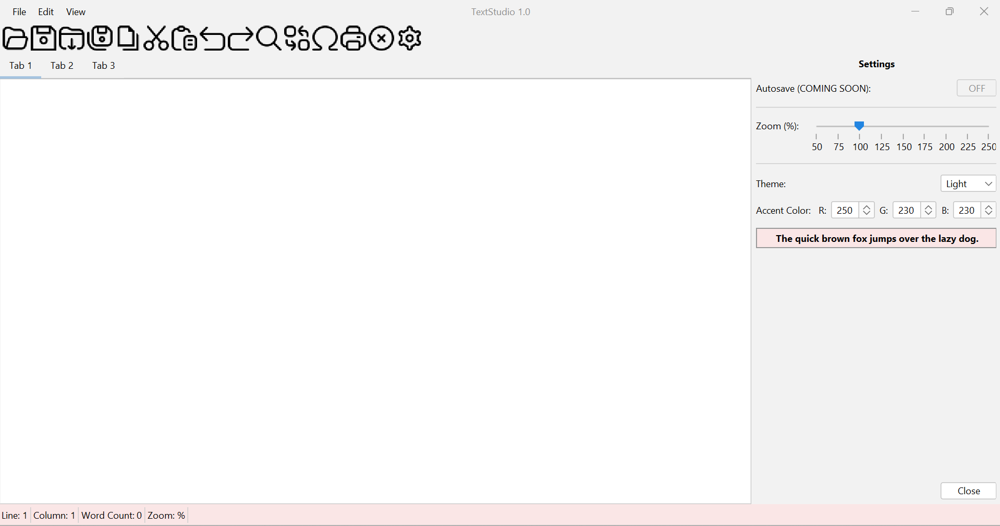
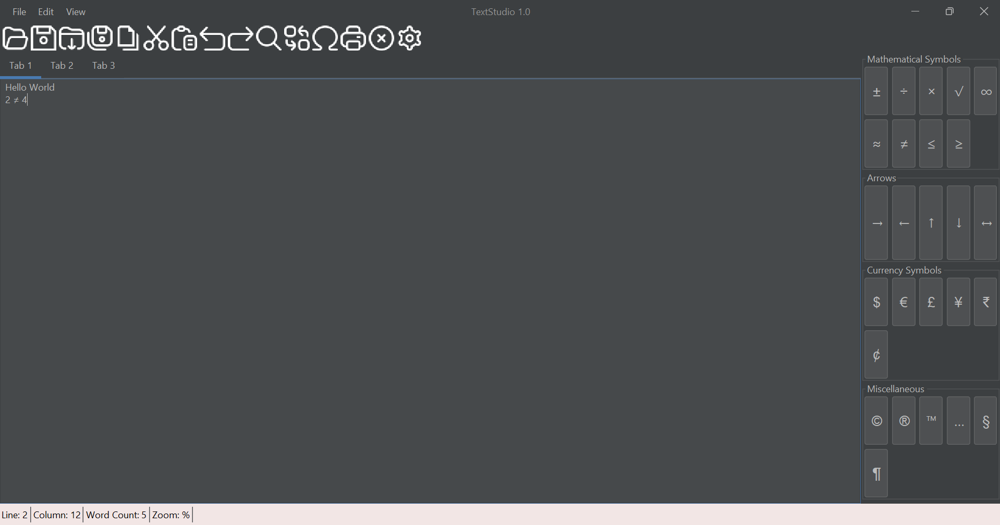
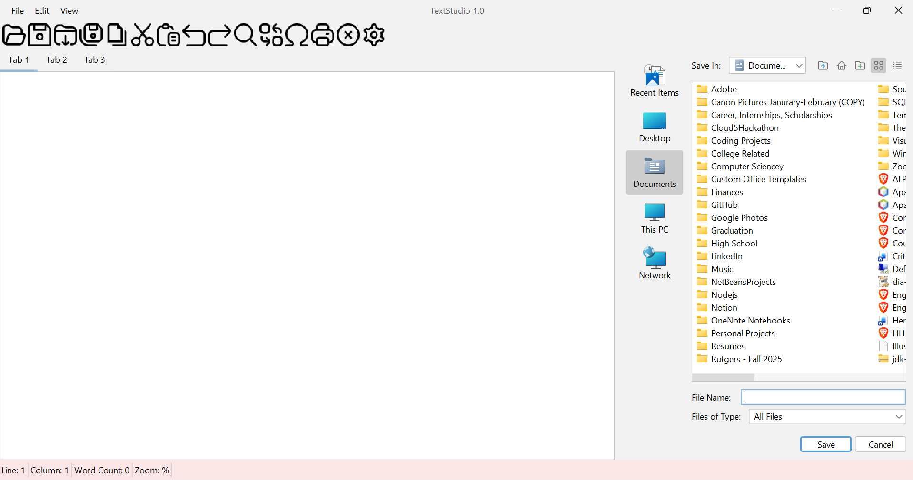

# TextStudio 1.0

    

TextStudio 1.0 is a **modular, Java-based desktop text editor** developed using the **Swing** framework. It features a **multi-tabbed interface**, a **dynamic theming engine**, and specialized tools for **technical writing**.

---

## Table of Contents

- [Key Features](#-key-features)  
- [Screenshots](#-screenshots)  
- [Modular Project Structure](#-modular-project-structure)  
- [Technical Stack](#-technical-stack)  
- [How to Run](#-how-to-run)  
- [Why This Project Stands Out](#-why-this-project-stands-out)  
- [License](#-license)  

---

## Key Features

- **Integrated Symbol Palette**  
  Sidebar with categorized symbols for **Mathematical, Currency, Arrow, and Miscellaneous symbols** (e.g., `∞`, `€`, `©`).  

- **Modular Architecture**  
  Separate classes for core logic: **word counting, line tracking, and theme management** — clean and maintainable.  

- **Dynamic Theme Engine**  
  Switch instantly between **Dark Mode** and **Light Mode**.  

- **Custom RGB Personalization**  
  Adjust UI accent colors in **real-time**.  

- **Live Document Statistics**  
  Track **line count, column position, and word count** dynamically.

---

## Screenshots

### TextStudio Customizable Theme Features

### Symbol Palette

### Sidebar Feature

---

## Modular Project Structure
- **UI Components:** `FilePane.java`, `SpecialCharactersDialog.java`, `JSettings.java`  
- **Core Logic:** `WordCount.java`, `LineCount.java`, `ColumnCount.java`  
- **Theme Management:** `ColorTheme.java`  
- **Application Entry:** `TextEditorMain.java`

---

## Technical Stack

- **Language:** Java  
- **GUI Framework:** Java Swing / AWT  
- **Concepts:** Object-Oriented Design (OOD), Modular Programming, Event-Driven Architecture, File I/O  

---

## How to Run

Ensure you have **Java Runtime Environment (JRE)** installed.  

Run via JAR file:

```bash
java -jar TextStudio.jar
